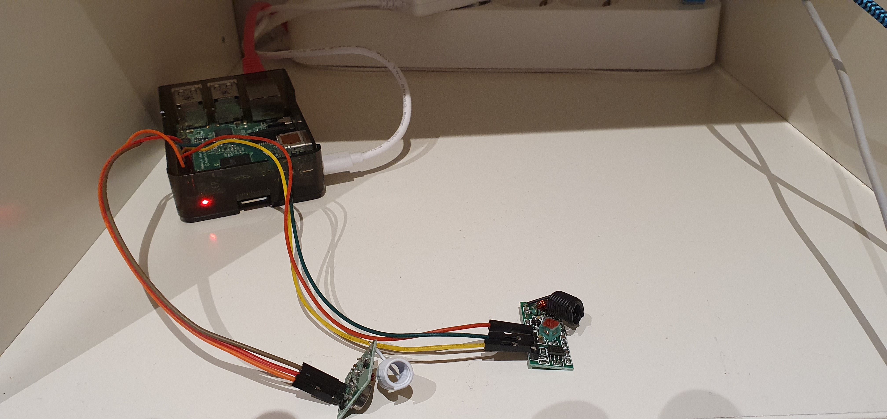
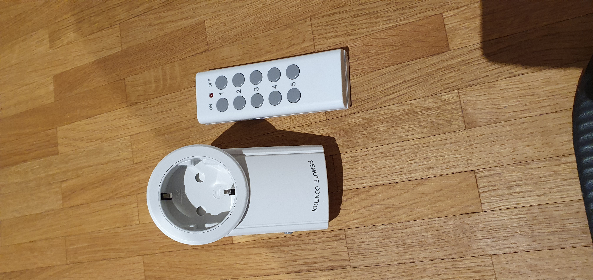

# RF 433 - Controller

This is a learning project, to get familiar with some tools. It is definitely over engineered, but it should make fun.

## The idea

Control a lamp with a RF433 sender and power socket controlled by a RF433 receiver.





## To Do's

- Documentation of Raspberry Installation
- REST-API
- Dockerfile Build
- Swagger Documentation
- Linters
- Dev Container
- Tests

## Installation of Raspberry Pi

You need
- Raspberry Pi
- 433 Mhz sender and receiver

Software Installation

``` bash
sudo apt-get update
sudo apt-get install git-core

git clone git://git.drogon.net/wiringPi

cd wiringPi
./build

cd

git clone git://github.com/xkonni/raspberry-remote.git
cd raspberry-remote
make send
```

## References

https://www.einplatinencomputer.com/raspberry-pi-433-mhz-funksteckdose-schalten/